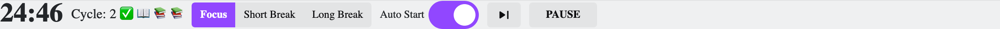

# 🍅TomatoWidget

This is a widget for [Trilium Notes](https://github.com/zadam/trilium) that displays a tomato timer. Inspired by [Tomato Timer Widget](https://github.com/Nriver/tomato-timer-widget), and [Pomofocus](https://pomofocus.io).

The integration with Trilium is minimal, mostly relying on the vanilla JavaScript.

## Features

- Configurable Durations: Allows setting the duration for focus sessions, short breaks, and long breaks, as well as the interval for long breaks, through a configuration object.
- Progress Tracking: Visualizes progress within a Pomodoro cycle (focus and break sessions) using symbols (✅ for completed, 📖 for current focus, 📚 for upcoming), and displays the current cycle number.
- Automatic Start Option: Includes a toggle switch to automatically start the next timer (focus or break), based on user preference stored in localStorage.
- Reset and Skip Features: Enables resetting the timer to a selected mode or skipping the current session, facilitating user control over the schedule.
- Local Storage Integration: Saves timer settings, mode, count, and auto-start preference in the browser's local storage, ensuring consistency across sessions.

## Installation

1. Download the `tomato-widget.zip` file from the [latest release](https://github.com/hypulse/trilium-tomato-widget/releases).
2. In Trilium, right click on the node you want to add the widget to, and import the zip file. Uncheck the `Safe Import` option.
3. Refresh the page.

## About

I've focused on keeping the code as simple and understandable as possible. The functionalities and styling are easy to modify or change. Feel free to add more fancy designs and cool features, then share your version!
